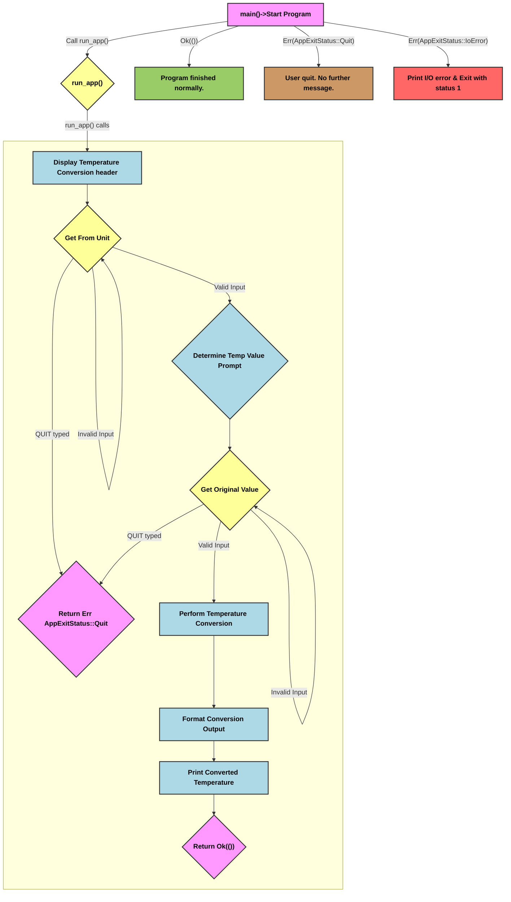

# Temperature Conversion Algorithm

The following flowchart represents the algorithm implemented in `src/main.rs`

## Algorithm Overview

The core algorithm follows these steps:

1.  **Initialize the Program**: The `main` function starts the application by calling `run_app`, which contains the main logic. The program prints a welcoming header to the user.

2.  **Get the Conversion Unit**: The program prompts the user to enter `C` to convert to Fahrenheit or `F` to convert to Celsius.

    - It uses a loop to repeatedly ask for input until a valid unit (C or F) or the quit command is entered.

    - If the user types `quit`, the program exits immediately with a specific status.

    - If the input is invalid, it displays an error message and prompts the user again.

    - Once a valid unit is provided, the program proceeds.

3.  **Get the Temperature Value**: Based on the unit selected in the previous step, the program prompts the user to enter a numeric temperature value.

    - Similar to the unit selection, it uses a loop to handle invalid input.

    - If the user enters `quit`, the program exits.

    - If the input is not a number, it displays an error and prompts the user again.

    - Once a valid number is provided, the program stores it.

4.  **Perform the Conversion**: The program uses the stored unit and value to create a `Temperature` object.

5.  **The `Temperature` object**: Calls a method to convert the temperature to the opposite unit based on standard formulas.

6.  **Display the Result**: After the calculation, the program formats the output to show the original temperature, the conversion formula used, and the final converted temperature. It uses specific formatting to display integers without decimal places.

7.  **End the Program**: The `run_app` function finishes, and the `main` function prints a `"Program finished normally"` message before the application closes.

**Key Concepts in the Code**:
     
+ **Enums for Clarity**: The `TemperatureUnit` enum clearly defines the two possible units, preventing errors from using plain strings. The `AppExitStatus` enum handles different ways the program can end.

+ **Structs for Data**: The `Temperature` struct encapsulates a value and its unit, ensuring this data is always handled together. This is a good example of object-oriented principles in Rust.

+ **Error Handling**: The `?` operator is used extensively to propagate errors up the call stack to the caller, i.e., the `main` function which handles the different program exit scenarios qracefully using pattern matching.

+ **Closure**: The `quit_prompt` closure eliminates code duplication when interacting 
with variables from its surrounding environment.

+ **Modularity**: The code is well-organized into separate functions for specific tasks like reading sanitized input (`read_sanitized_line`), getting user input with validation (`get_user_input`), and formatting the final output (`format_conversion_output`). This makes the code easier to read, test, and maintain.

**Key Functions**:

+ **`main()`**: This is the entry point of the program. Its primary purpose is to call `run_app()` and handle the different outcomes (successful execution, user quit, or an I/O error) by printing appropriate messages and exiting with a status code if necessary.

+ **`run_app()`**: This function contains the main application logic. It orchestrates the entire conversion process, including getting user input for the unit and temperature value, performing the calculation, and printing the result. It returns a `Result` type, which allows `main` to handle the program's `exit` status.

+ **`get_user_input<T>`**: This is a generic function designed to handle user input for any type that implements the `FromStr` trait (like `f64` or `TemperatureUnit`). Its purpose is to:

  - Prompt the user for input.

  - Read a line from standard input.

  - Handle the `quit` command, returning an `AppExitStatus::Quit` error.

  - Attempt to parse the input into the desired type `T`.

  - If parsing fails, it prints an error message and loops, prompting the user again.

  - If parsing succeeds, it returns the parsed value.

+ **`read_sanitized_line()`**: This is a helper function used by `get_user_input`. Its purpose is to read a line from standard input, remove leading/trailing whitespace, and convert the entire string to lowercase. It returns a `Result<String, io::Error>`.

+ **`format_conversion_output()`**: This function's purpose is to take the original and converted temperature data and generate a formatted string that explains the conversion. It handles different formatting based on whether the resulting temperature is a whole number or has a decimal part.

+ **`quit_prompt`**: This is a closure defined within the `run_app()` function. Its purpose is to encapsulate and reuse the logic for displaying the program's standard prompt, which includes the message about how to quit the application. It takes a message string (`msg`) and prints it along with the "`Type QUIT...`" instruction.

+ **`to_celcius()` (method of `Temperature`)**: This method is responsible for performing the conversion from Fahrenheit to Celsius using the formula $`(F - 32) \times \frac{9}{5}`$.

+ **`to_fahrenheit()` (method of `Temperature`)**: This method is responsible for performing the conversion from Celsius to Fahrenheit using the formula $`(C \times \frac{5}{9}) + 32`$.

+ **`convert_to()` (method of `Temperature`)**: This method acts as a public interface for conversion. It takes a target `TemperatureUnit` and calls the appropriate internal conversion method (`to_celcius` or `to_fahrenheit`) based on a match statement. If the target unit is the same as the original, it returns a clone of the original temperature.